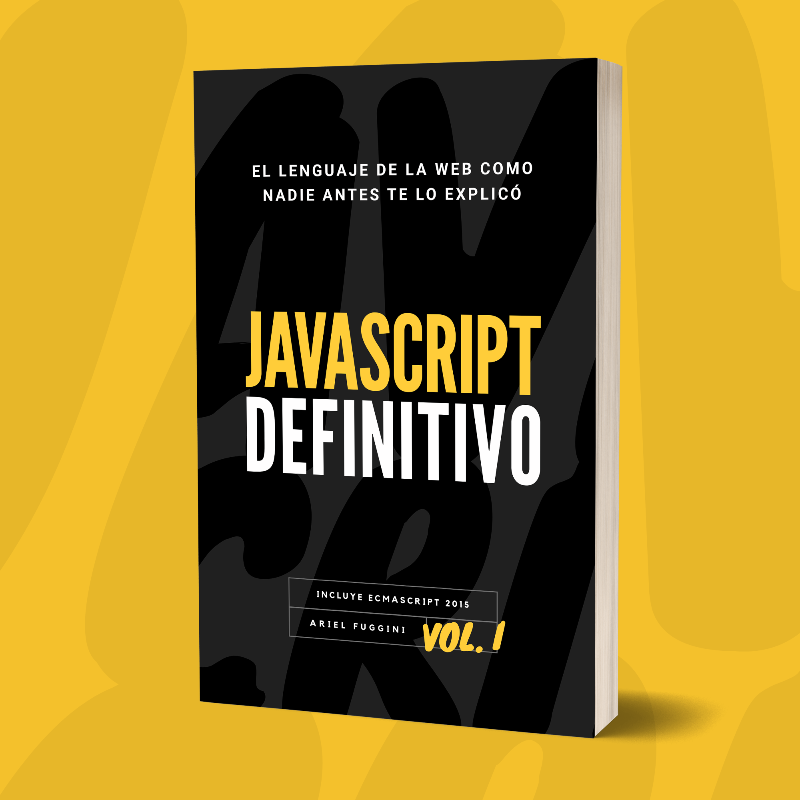

# JavaScript Definitivo Vol. I

En este repositorio encontrarás el contenido completo de mi libro **JavaScript Definitivo Vol. I**.

En este ebook te enseño JavaScript desde cero, como nadie te lo explicó antes. Con una base sólida combinada con ejemplos prácticos, en un lenguaje sencillo y amigable.

Aprende y domina a fondo las principales características del lenguaje:

* **Tipo y Estructuras de Datos**: ¿Todo son objetos?
* **Variables**: ¡No son cajas!
* **Operadores**: La guía definitiva
* **Control de Flujo**: ¡Lo entenderás en la primera vuelta!
* **Manejo de Números**: Fácil como «2 + 2»
* **Manejo de Strings**: ¡Rompe las cadenas!
* **Objetos y Arrays**: Domina tu colecciones
* **Funciones**: ¿Cómo «funcionan»?
* **Coerción**: Lo que nadie te explica
* **DOM**: Manipula tu HTML sin frameworks
* **Eventos**: ¡Controlándolo todo!
* **ES2015**: «¿Qué hay de nuevo, viejo?»

## Índice

* [Introduccion](contenido/00%20-%20Introduccion.md)
* [Sintaxis](contenido/01%20-%20Sintaxis.md)
* [Tipos de Datos](contenido/02%20-%20Tipos%20de%20Datos.md)
* [Operadores](contenido/03%20-%20Operadores.md)
* [Variables](contenido/04%20-%20Variables.md)
* [Control de Flujo](contenido/05%20-%20Control%20de%20Flujo.md)
* [Funciones](contenido/06%20-%20Funciones.md)
* [Booleanos](contenido/07%20-%20Booleanos.md)
* [Numeros](contenido/08%20-%20Numeros.md)
* [Strings](contenido/09%20-%20Strings.md)
* [Objetos](contenido/10%20-%20Objetos.md)
* [Arrays](contenido/11%20-%20Arrays.md)
* [Coercion](contenido/12%20-%20Coercion.md)
* [Temporizadores](contenido/13%20-%20Temporizadores.md)
* [Manipulando el DOM](contenido/14%20-%20Manipulando%20el%20DOM.md)
* [Eventos del DOM](contenido/15%20-%20Eventos%20del%20DOM.md)
* [ECMAScript 2015](contenido/16%20-%20ECMAScript%202015.md)
* [Sobre el Autor](contenido/17%20-%20Sobre%20el%20Autor.md)

Puedes adquirir el libro en formato ebook [en mi sitio web](https://arielfuggini.com/javascript-definitivo-vol1/).
