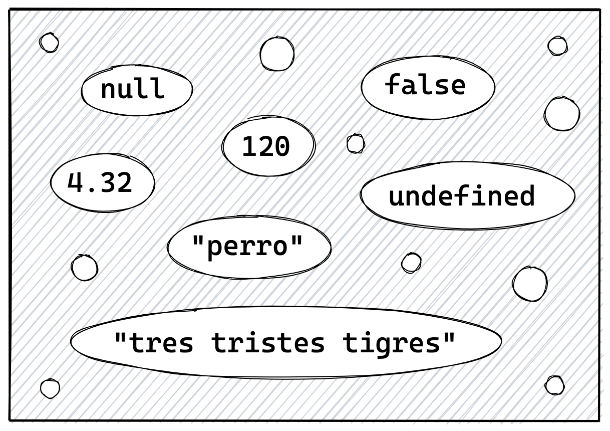

# Tipos de Datos

En JavaScript existen dos categorías de datos: los **primitivos** y los **objetos**.

## Primitivos

Los tipos **primitivos** son los tipos de datos más básicos de JavaScript. Al día de hoy, el lenguaje cuenta oficialmente con 6 tipos primitivos:

* Number
* String
* Boolean
* Null
* Undefined
* Symbol

### Number

El tipo **Number** abarca todos los datos de tipo numérico. Pueden ser números enteros o decimales, como también otros tipos de valores numéricos como hexadecimales, binarios, y octales.

```javascript
256    // entero
3.14   // decimal
1e5    // notación de exponenciación (100000)
1e-5   // notación de exponenciación (0.00001)
0644   // octal (anteponiendo 0) (420)
0o10   // octal (anteponiendo 0o) (8)
0b1000 // binario (anteponiendo 0b) (8)
0xFF   // hexadecimal (255)
```

### String

El tipo de dato **String** nos permite almacenar y manipular cadenas de texto.

Para crear lo que llamamos un *literal de string*, simplemente encerramos nuestra cadena de caracteres entre comillas dobles (`"`) o comillas simples (`'`) (el resultado es el mismo, esta elección es simplemente una cuestión de preferencia). Y a partir de ECMAScript 2015, también podemos definirlas utilizando tildes invertidas (``` ` ```).

```javascript
"Esto es un string"
"Esto también es un string"
`Esto es un string a partir de ES2015`
```

### Boolean

El tipo **Boolean** o booleano tiene dos únicos valores posibles: `true` o `false`.

```javascript
true
false
```

### Null

El tipo **Null** tiene un único valor posible, `null`. Este representa la ausencia intencional de valor, es decir, para indicar que un valor es nulo o está vacío.

```javascript
null
```

Si bien la especificación de ECMAScript indica que corresponde usarlo en contextos en los cuales el valor esperado es un objeto, en la práctica se utiliza para indicar la ausencia de cualquier tipo de valor, incluídos los valores primitivos.

### Undefined

El tipo **Undefined** también posee un único valor, `undefined`.

Similar a `null`, representa la ausencia de un valor. Sin embargo, la diferencia está en su intención. Mientras que `null` representa un valor intencionalmente definido como nulo, `undefined` es un valor no definido *en un determinado momento*, algo así como *a la espera de un valor*.

```javascript
undefined
```

Cuando en JavaScript declaramos una variable sin asignarle un valor inicial, se le asigna automáticamente el valor `undefined`.

```javascript
var x;

x;  // → undefined
```

### Symbol

**Symbol** es un tipo de dato que aparece en ES2015, y se utiliza principalmente para crear referencias únicas llamadas *símbolos* para identificar propiedades de objetos.

```javascript
Symbol()
Symbol("descripcion")
```

Por ser un tipo de dato poco frecuente no profundizaremos sobre su uso en este libro.

### Llegando en ES2021: BigInt

**BigInt** aparece en ECMAScript 2021, que aún no es oficial al momento de escribir este libro. Por lo tanto es el más nuevo de los tipos primitivos.

Fue creado para trabajar con números enteros más grandes de los que soporta el tipo **Number**.

```javascript
84920323940298340n

// o bien

BigInt(84920323940298340)
```

Al igual que **Symbol**, dado que **BigInt** es un tipo de dato nuevo y aun casi no utilizado, no ahondaremos en él.

## Características de los Tipos Primitivos

Los tipos primitivos son datos de **bajo nivel**, es decir, están más cerca de los ceros y unos. Eso, entre otras cosas, los hace más rápidos de procesar.

Además, son **inmutables**, es decir, no pueden ser modificados. Pueden ser reemplazados por otros valores luego de ser asignados a una variable, como veremos más adelante, pero no pueden ser alterados en sí mismos. Son valores de **sólo lectura**.

Para comprender mejor los tipos primitivos, te voy a proponer que de ahora en más, pensemos en ellos como valores que **existen antes de que los nombremos**, en una especie de universo paralelo al que podemos llamar *universo primitivo*.

Entonces, tanto `null`, `undefined`, `true`, `false`, `3.14`, y `"tres tristes tigres"`, así como todos los números y cadenas de caracteres que podamos imaginar, habitan este *universo primitivo*, y nosotros simplemente los referenciamos cuando los necesitamos.

Esto cobrará aún más sentido cuando hablemos sobre ***Variables***.



## Objetos

La otra categoría de estructuras de datos en JavaScript son los **objetos**. Un objeto es un constructo, una estructuras más complejas que un primitivo. Podríamos definirlo como una **colecciones de propiedades**.

En JavaScript es posible crear nuestros propios objetos. Por ejemplo, un *literal de objeto* consiste en una serie de propiedades y valores, separados por comas, y encerrados entre llaves.

```javascript
var automovil = {
  marca: "Audi",
  año: 2020,
  valor: null,
  caracteristicas: { abs: true }
}
```

JavaScript nos provee también de una serie de **objetos globales** o **nativos**, que nos son útiles para diferentes tareas. Por ejemplo, el objeto **Date** nos permite trabajar con fechas y datos temporales, o el objeto **Math**, que nos sirve para realizar diversas operaciones matemáticas y numéricas complejas.

```javascript
// método de redondeo
Math.round(3.1415)  // → 3

// crea un objeto fecha
new Date(2020, 3, 1)
// → Wed Apr 01 2020 00:00:00...
```

JavaScript cuenta además con dos *subtipos* de objetos que poseen características distintivas: el **array** y la **función**.

### Array

Un **array**, también conocido en español como *Matriz* o *Arreglo*, es una colección de elementos **ordenados** e **indexados**, es decir, ordenados con un índice numérico.

```javascript
// array de strings
["lunes", "martes", "miercoles", "jueves", "viernes"]

// array numérico
[1, 1, 2, 3, 5, 8]

// array mixto
[26, true, "js", new Date(), {}]
```

### Función

Por su parte, una **función** es un tipo de objeto que posee la particularidad de que, al ser declarado, no se ejecuta inmediatamente, sino que se guarda en memoria para ser invocado más tarde, una o más veces.

Existen diferentes formas para declarar una función:

```javascript
function miPrimerFuncion () {
  return "Hola mundo";
}

// o bien

var miPrimeraFuncion = function () {
  return "Hola mundo";
}

// o bien a partir de ES2015

const miPrimeraFuncion = () => {
  return "Hola mundo";
}

// invocamos a la función
miPrimerFuncion()  // → "Hola mundo"
```
