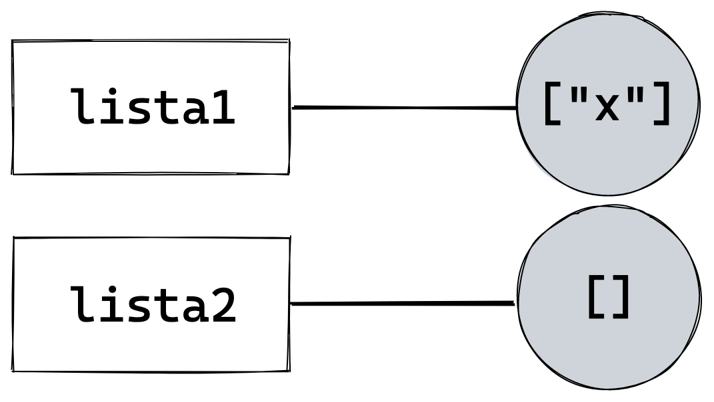

# Variables

Las variables son un componente importante de muchos de los lenguajes de programación, incluido JavaScript. Una variable es esencialmente una **referencia**, que nos permite etiquetar un valor y guardarlo en la memoria para utilizarlo más tarde.

Para declarar una variable, lo hacemos utilizando la palabra clave `var`, seguida de un nombre que la identifique.

```javascript
var miPrimerVariable = "Hola mundo";
```

Podemos almacenar cualquier tipo de dato en una variable.

```javascript
var mascota = "Perro";
var patas = 4;
var ladra = true;
var comidasFavoritas = ["Croquetas", "Filetes"];
```

Las variables nos sirven para reutilizar valores, realizar operaciones sobre ellos, pasarlos como argumentos a funciones, entre otros.

```javascript
var valor1 = 3;
var valor2 = 2;

// operación de multiplicación
valor1 * valor2;  // → 6

// como argumentos de función
console.log(valor1, valor2);
```

## No son cajas

Muchas veces leyendo en internet vamos a encontrar definiciones de variable representándolas como **cajas** que contienen un valor. Sin embargo, esta explicación no nos ayuda a hacernos un modelo mental correcto de cómo funciona una variable.

En lugar de eso, te propongo imaginar que declarar una variable es como crear una **etiqueta**, y que al asignarle un valor, estamos tendiendo un **hilo** que conecta esta etiqueta con el valor.

```javascript
var mascota = "Perro";
```


## Asignación e Igualdad

Dicho esto, vale la pena también hacer una aclaración adicional:

A> Es frecuente que se confundan las variable con valores. **Una variable no es un valor**, sino que **hace referencia** a un valor.

Siguiendo con el ejemplo anterior, declaramos ahora una nueva variable `animal`, y le asignamos también el valor `"Perro"`.

```javascript
var mascota = "Perro";
var animal = "Perro";
```

Cuando hablamos de los tipos primitivos, dijimos que ellos existen antes que los nombremos, en un *universo primitivo*, y que nosotros simplemente los evocamos o referenciamos. Entonces, siguiendo esta lógica, como el string `"Perro"` ya existe, las dos variables `mascota` y `animal` van a estar conectadas al mismo valor.


Esto es exactamente igual a declarar la nueva variable de la siguiente manera:

```javascript
var mascota = "Perro";
var animal = mascota;
```

Al igualar `animal` a `mascota`, lo que estamos haciendo es unir ambas etiquetas `animal` y `mascota` al mismo valor primitivo.

En ambos ejemplos, las dos variables referencian al string `"Perro"`, y por lo tanto al compararlas con el operador de igualdad estricta nos arrojará `true`.

```javascript
mascota === animal;  // → true
```

Y es que ambas variables son ahora equivalentes al literal de string `"Perro"`. Y `"Perro"` es siempre igual a `"Perro"`.

```javascript
"Perro" === "Perro";  // → true
```

Supongamos ahora que más adelante en nuestro código queremos reemplazar el valor de `mascota` por el string `"Gato"`.

```javascript
var mascota = "Perro";
var animal = mascota;

// luego...

mascota = "Gato";
```

Te propongo tomarte unos minutos y reflexionar: ¿cuál es ahora el valor de la variable `animal`?

```javascript
animal;  // ???
```

La respuesta es la siguiente: según nuestro modelo de *etiquetas*, al modificar el valor de `mascota`, estamos desconectando el hilo que la une al valor `"Perro"` y reconectándolo con el valor `"Gato"`.

Sin embargo, la variable `animal` sigue conectada al string `"Perro"`, y por lo tanto ese seguirá siendo su valor.

```javascript
var mascota = "Perro";
var animal = mascota;

mascota = "Gato";

animal;  // → "Perro"
```


En este ejemplo podemos ver claramente por qué, si pensáramos las variables como cajas, podríamos creer que `animal` contiene a `mascota`, y por lo tanto al modificar en valor de `mascota`, estaríamos cambiando también el valor de `animal`, lo cual sería incorrecto.


A> Las variables se conectan con valores, y no con otras variables. Siempre de un lado del hilo está la etiqueta, y del otro, el valor.

Veamos ahora un ejemplo utilizando objetos, en este caso arrays.

Declaramos una variable `lista1` y le asignamos como valor un objeto array vacío. Luego repetimos lo mismo con `lista2`.

```javascript
var lista1 = [];
var lista2 = [];
```

¿Es igual el valor de estas dos variables?

Vamos a preguntarle a JavaScript:

```javascript
lista1 === lista2;  // → false
```

La comparación nos arroja `false`. ¿Por qué?

Cada vez que asignamos a una variable un literal de objeto con `[]` o `{}`, estamos creando en ese instante un objeto nuevo.


Como resultado, `lista1` y `lista2` hacen referencia a dos objetos diferentes.

Es por eso que al intentar comparar objetos o arrays con el operador de igualdad, el resultado será siempre `false`.

```javascript
[] === [];                        // → false
{} === {};                        // → false
["diferente"] === ["diferente"];  // → false
{ valor: 0 } === { valor: 0 };    // → false
```

Siguiendo con el ejemplo, insertamos ahora un string `"x"` en la posición `0` del array `lista1`.

```javascript
var lista1 = [];
var lista2 = [];

lista1[0] = "x";
```

Con lo que ya sabemos, podemos tener la certeza de que, al ser arrays diferentes, al modificar uno, no alteraremos el otro.



Fácil ¿verdad?

Ahora veamos que sucede con el siguiente código:

```javascript
var lista1 = [];
var lista2 = [];

lista1[0] = "x";

lista2 = lista1;

lista2[0] = "y";
```

A partir del fragmento anterior ¿cuál sería la representación correcta? Tómate unos minutos para refleccionarlo.


Vayamos paso a paso.

```javascript
lista2 = lista1;
```

Al igualar `lista2` a `lista1`, lo que estamos haciendo es equivalente a desconectar `lista2` de un array, y reconectándola al otro, al mismo que `lista1`.


El array que antes estaba conectado a `lista2` ahora quedó desconectado de toda variable, y por lo tanto partir de ahora es inalcanzable, por lo que JavaScript lo va a eliminar para liberar memoria, en un proceso llamado *Garbage Collection*.

Ahora, `lista1` y `lista2` están unidas (referencian) al mismo array, que a estas alturas equivale a `["x"]`, y por lo tanto cualquier alteración o *mutación* en este array se reflejará en ambas variables.

De manera que la respuesta correcta es la **B**. Al modificar el índice `0` de `lista2`, estamos mutando el array al que ambas conectan.

```javascript
lista2[0] = "y";

lista1;  // → ["y"]
lista2;  // → ["y"]
```


En este caso sí, al comparar ambas **referencias**, obtendremos un resultado positivo.

```javascript
lista1 === lista2;  // → true
```

## Tipado en JavaScript

JavaScript es un lenguaje llamado de *tipado dinámico*. Esto quiere decir que, mientras en otros lenguajes es necesario hacer explícito el tipo de variables al declararla (por ejemplo, si es de tipo `string`, `boolean`, etc), en JavaScript **las variables no tienen tipo**, sino que el tipo (en inglés *type*) es una característica del valor.

Es por eso que en JavaScript podemos asignarle a una variable un valor de cualquier tipo, por ejemplo `string`, y más tarde reemplazarlo por otro, por ejemplo un `number`, sin provocar ningún error.

Si bien el lenguaje nos brinda esta posibilidad, asignar a una variable diferentes tipos de datos a lo largo de una misma aplicación puede generar inconsistencias y confusión si no somos extremadamente cuidadosos y explícitos, por lo cual te recomiendo evitarlo siempre que sea posible.

```javascript
var a = "Ariel";
typeof a;  // → "string"
a = 34;
typeof a;  // → "number"
a = true;
typeof a;  // → "boolean"
a = [];
typeof a;  // → "object"
a = undefined;
typeof a;  // → "undefined"
```

## Conocer el Tipo de Valor

Para conocer el tipo de valor podemos utilizar el operador `typeof`, como ya vimos ejemplificado anteriormente.

```javascript
typeof "Hola mundo"  // → "string"
typeof 39548         // → "number"
typeof true          // → "boolean"
typeof false         // → "boolean"
typeof {}            // → "object"
typeof []            // → "object"
typeof null          // → "object"
typeof Date          // → "object"
typeof Math.round    // → "function"
typeof BigInt(23)    // → "bigint"
typeof Symbol()      // → "symbol"
typeof noExiste      // → "undefined"
```

En el caso de un array, `typeof` nos devuelve `"object"` porque, en rigor, un array es un tipo de objeto. Para evitar confundirlo con cualquier otro tipo de objeto, podemos utilizar el método `Array.isArray()`.

```javascript
var x = [1, 4, 6];
Array.isArray(x);  // → true

var y = ["enero", "febrero", "marzo"];
Array.isArray(y);  // → true

var z = { noEs: "un array" };
Array.isArray(z);  // → false
```

Por otra parte, `null` es en rigor un dato de tipo **Null** según la especificación de ECMAScript. Sin embargo, `typeof` nos arroja que es un `"object"`. Esto se debe a un *bug* que data de las primeras versiones de JavaScript, y que se ha decidido deliberadamente no corregir, ya que esto podría provocar otros bugs de forma masiva.

Por lo tanto, para saber si una variable es `null`, podemos utilizar el operador de igualdad estricta `===`:

```javascript
var n = null;

n === null;  // → true
```

## Ámbito de las Variables (Scope)

Analicemos el siguiente código.

```javascript
var a = 1;

function scope () {
  a = 3;
  var b = 4;

  a;  // → 3
  b;  // → 4
}

a;  // → ?
b;  // → ?

scope();

a;  // → ?
b;  // → ?
```

¿Qué valor poseen `a` y `b` antes y después de invocar la función `scope()`?

En JavaScript el ámbito de las variables declaradas con `var` lo define la función. Por lo tanto, las variables tienen un alcance limitado al contexto de la función dentro de la cual son declaradas, es decir, quedan inaccesibles fuera de ese ámbito o *scope*.

En el ejemplo, la primera vez que llamamos a `a` fuera de la función, esta preserva el valor con el que fue declarada en la primera línea. Por lo tanto su valor es `1`. `b` sin embargo no fue declarada, y por lo tanto devuelve `undefined`.

Al invocar la función `scope()`, se les asigna un nuevo valor a `a`, y se declara una variable `b`. Ámbas están ahora disponibles dentro del ámbito de la función.

¿Qué sucede con `a` y `b` fuera de la función después de invocar `scope()`?

`a` fue modificada y por lo tanto su valor es `3`. Sin embargo, `b` sigue sin existir en el contexto global (fuera de la función), y por lo tanto sigue siendo `undefined`.

A partir de ES2015, `let` y `const` nos permiten declarar variables que cuyo ámbito funciona de manera diferente. Esto lo desarrollo en detalle en el capítulo sobre ***ECMAScript 2015***.

## Nombrar Variables

Al elegir el nombre de una variable debemos tener en cuenta ciertas reglas y limitaciones.

* Los nombres de una variable sólo pueden contener **letras**, **números**, `_`, y `$`;
* No pueden comenzar con un **número**;
* Distinguen mayúsculas y minúsculas, es decir que `x` y `X` serán variables diferentes;
* No se permite usar ciertas palabras reservadas de JavaScript, es decir las que poseen un significado especial, como por ejemplo `if`, `for`, `break`, `function`, etc;
