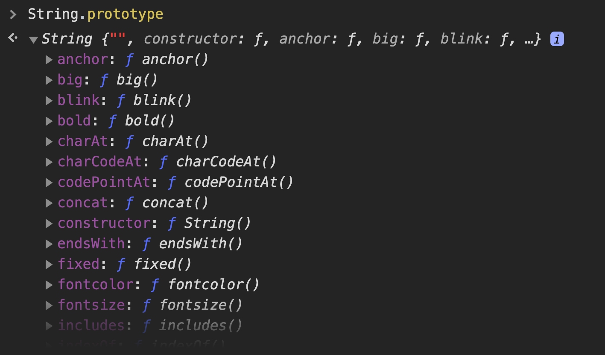

# Strings

Los **strings** son valores de texto. Los caracteres del un string estan indexados, es decir, a cada uno le corresponde una posición numérica dentro de la cadena de texto, comenzando por el `0`.

Tomemos como ejemplo el siguiente string:

```javascript
"El gato gris"
```

La representación de los caracteres indexados se vería entonces así:

| 0 | 1 | 2 | 3 | 4 | 5 | 6 | 7 | 8 | 9 | 10 | 11 |
|:-:|:-:|:-:|:-:|:-:|:-:|:-:|:-:|:-:|:-:|:--:|:--:|
| E | l |   | g | a | t | o |   | g | r | i  | s  |

Por lo tanto, igual que en un array, podemos acceder a un caracter específico de un string utilizando la siguiente sintaxis:

```javascript
var texto = "El gato gris";

texto[0];   // → "E"
texto[2];   // → " "
texto[11];  // → "s"
```

Sin embargo, como ya hemos mencionado, **los valores primitivos no son mutables**. De manera que, a diferencia de los array, los caracteres de un string no se pueden modificar.

```javascript
var texto = "El gato gris";

texto[3] = "p";
texto[4] = "e";
texto[5] = "r";
texto[6] = "r";
texto[7] = "o";

texto;  // → "El gato gris";
```

## String()

La función global `String()` nos permite crear valores de tipo `string` a partir de cualquier valor.

```javascript
String(3.14)            // → "3.14"
String(true)            // → "true"
String(false)           // → "false"
String(function () {})  // → function () {}
String(undefined)       // → "undefined"
String(null)            // → "null"
String([1, 2, 3])       // → "1,2,3"
String({ a: 1, b: 2 })  // → "[object Object]"
String(NaN)             // → "NaN"
String(Symbol())        // → "Symbol()"
String(2 * 3)           // → "6"
String(true ? 0 : 1)    // → "0"
```

A> Para conocer en mayor profundidad las posibilidades que nos da `String` puedes visitar [este link](https://developer.mozilla.org/es/docs/Web/JavaScript/Referencia/Objetos_globales/String).

## Propiedades y Métodos de String

Podemos conocer todos los métodos de `String` disponibles explorando el prototipo del objeto global `String` en la consola de Google Chrome, utilizando la siguiente expresión:

```javascript
String.prototype
```

Esto nos va a devolver una lista de métodos similar a la siguiente:



### length

Mediante la propiedad `length` podemos conocer la longitud de un string.

```javascript
var texto = "Aprendiendo JavaScript!";

texto.length;  // → 23
```

### indexOf()

El método `indexOf()` recibe como argumento un string, y devuelve un número que equivale a la posición en la cual coincide por primera vez el argumento con el string inicial. Si no hay coincidencias, devuelve `-1`.

```javascript
var texto = "El gato en el tejado";

texto.indexOf("en");     // → 8
texto.indexOf("gato");   // → 3
texto.indexOf(" ");      // → 2
texto.indexOf("perro");  // → -1
```

### replace()

El método `replace()` reemplaza un fragmento de un string por otro, y retorna un nuevo string con el resultado.

```javascript
string.replace(valorBuscado, nuevoValor);
```

Si pasamos como valor buscado un string, `replace` reemplaza solo la primer coincidencia en el string inicial.

```javascript
var a = "dos mas dos son cuatro";
var b = a.replace("dos", "cinco");

a;  // → "dos mas dos son cuatro"
b;  // → "cinco mas dos son cuatro"
```

En cambio, si utilizamos [expresiones regulares](https://developer.mozilla.org/es/docs/Web/JavaScript/Guide/Regular_Expressions), podemos buscar y reemplazar todas las repeticiones del valor buscado.

```javascript
var a = "dos mas dos son seis";
var b = a.replace(/dos/g, "tres");

a;  // → "dos mas dos son seis"
b;  // → "tres mas tres son seis"
```

Las **expresiones regulares** son unos patrones utilizados para encontrar combinaciones de caracteres dentro de un string.

Para utilizarlas con el método `replace` y reemplazar todas las ocurrencias de un valor en una cadena de texto, podemos utilizar el siguiente patrón como primer argumento:

```javascript
/valor buscado/g
```

Nota como el valor buscado no está rodeado de comillas sino de barras `/`. La `g` al final corresponde a *global*, y es la que indica que se debe buscar todas las ocurrencias del valor dentro de una determinada cadena de texto.

### concat()

El método `concat()` une (concatena) uno o más strings, y devuelve un string nuevo.

```javascript
var nombre = "Lionel";
var nombreCompleto = nombre.concat(" Andrés", " Messi");

nombreCompleto;  // → "Lionel Andrés Messi"
```

Este resultado también puede conseguirse utilizando el operador `+`.

```javascript
var nombres = "Lionel";
var nombreCompleto = nombre + " Andrés" + " Messi";

nombreCompleto;  // → "Lionel Andrés Messi"
```

O bien con sintaxis de ES2015, utilizando *plantillas de string*:

```javascript
var nombres = "Lionel";
var nombreCompleto = `${nombres} Andrés Messi`;

nombreCompleto;  // → "Lionel Andrés Messi"
```

### trim()

El método `trim()` elimina cualquier espacio vacío antes y después del string, y devuelve un nuevo string con el resultado.

```javascript
var conEspacios = "     Sigue el camino amarillo  ";
var sinEspacios = cadenaConEspacios.trim();

sinEspacios;  // → "Sigue el camino amarillo"
```

### split()

El método `split()` divide el string en un conjunto de strings y los devuelve en forma de array. Recibe como argumento un string sobre el cual hacer la división.

```javascript
var dias = "Lunes - Martes - Miercoles";
var listaDeDias = dias.split(" - ");

listaDeDias;
// → ["Lunes", "Martes", "Miercoles"]
```

### toUpperCase() y toLowerCase()

Los métodos `toUpperCase()` y `toLowerCase()` transforman la cadena de texto en mayúsculas y minúsculas, respectivamente, y devuelven un nuevo string con el texto resultante.

```javascript
var texto = "El David de Miguel Ángel";
var mayusculas = texto.toUpperCase();
var minusculas = texto.toLowerCase();

texto;       // → "El David de Miguel Ángel"
mayusculas;  // → "EL DAVID DE MIGUEL ÁNGEL"
minusculas;  // → "el david de miguel ángel"
```

A> Para una lista completa de métodos de String visita [este link](https://developer.mozilla.org/es/docs/Web/JavaScript/Referencia/Objetos_globales/String/prototype)
