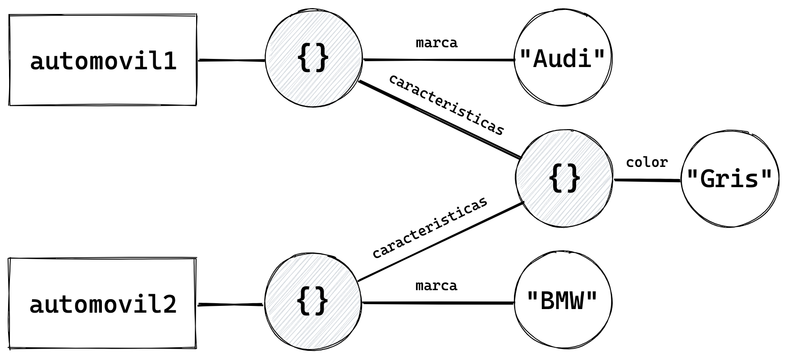

# Objetos

Los objetos en JavaScript son muy similares a los objetos en la vida real. Vamos a tomar como ejemplo un objeto cotidiano: un automóvil.

Un automóvil tiene ciertas características:

* Marca
* Modelo
* Color
* Velocidad máxima
* Capacidad de pasajeros
* etc

Algunas de estas características podemos modificarlas a voluntad. Por ejemplo, podríamos pintarlo para cambiar su color. Otras no son modificables, como la marca o el modelo.

Un automóvil tiene también la capacidad de realizar ciertas acciones, como darle arranque, encender las luces, acelerar, frenar, subir o bajar los cambios, etc.

Los objetos de JavaScript funcionan de forma similar. Poseen características a las cuales llamamos **propiedades**, algunas de las cuales podemos modificar, mientras que otras son de *solo lectura*. Y también puede realizar acciones, mediante funciones, que al pertenecer a objetos reciben el nombre de **métodos**.

JavaScript nos provee una serie de objetos globales que nos permiten realizar diferentes funciones. Y además nos da la posibilidad de crear nuestros propios objetos.

## Literales de Objeto

Un *literal de objeto* consiste en una serie de propiedades y valores, separados por comas, y encerrados entre llaves.

Veamos por ejemplo como se vería un automóvil en forma de objeto de JavaScript:

```javascript
var automovil = {
  marca: "Ford",
  precio: null,
  caracteristicas: {
    abs: true,
    "velocidad máxima": 289.6,
  }
};
```

Como vemos, nuestro objeto consiste en una serie de propiedades que pueden ser valores de cualquier tipo, en este caso strings, `null`, números, booleanos e incluso otro objeto.

Para acceder a las diferentes propiedades de los objetos, lo hacemos con la siguiente sintaxis:

```javascript
automovil.marca;   // → "Ford"
automovil.precio;  // → null
automovil.caracteristicas.abs;  // → true

// o bien

automovil["marca"];   // → "Ford"
automovil["precio"];  // → null
automovil["caracteristicas"]["abs"];  // → true
```

Ambas sintaxis en este ejemplo se pueden usar indistintamente. Sin embargo, cuando el nombre de una propiedad posee caracteres especiales o espacios (como en nuestro ejemplo la propiedad `"velocidad máxima"`), debe ser declarada entre comillas, y solo se puede acceder utilizando la sintaxis con corchetes.

```javascript
automovil.caracteristicas["velocidad máxima"];  // → 289.6
```

Una vez creado un objeto, podemos adjuntarle nuevas propiedades más tarde.

```javascript
automovil.modelo = "Mustang";
automovil.caracteristicas.color = "Negro";

// o bien

automovil["modelo"] = "Mustang";
automovil["caracteristicas"]["color"] = "Negro";
```

Nuestros objetos también pueden contener métodos.

```javascript
automovil.encender = function () {
  // implementación del método
}

automovil.acelerar = function () {
  // implementación del método
}
```

Luego para invocar los métodos del objeto utilizamos la siguiente sintaxis:

```javascript
automovil.encender();
automovil.acelerar();
```

Veamos una versión alternativa de nuestro objeto automóvil, esta vez con propiedades y métodos implementados, que luego explicaremos bloque por bloque.

```javascript
var automovil = {
  estado: {
    encendido: false,
    luces: false,
    velocidadActual: 0,
    velocidadMaxima: 200
  },

  encender: function () {
    this.estado.encendido = true;
    this.estado.luces = true;
    return this.estado;
  },
  apagar: function () {
    this.estado.encendido = false;
    this.estado.luces = false;
    return this.estado;
  },
  acelerar: function () {
    if (
      this.estado.encendido
      && this.estado.velocidadActual
      <= this.estado.velocidadMaxima
    ) {
      this.estado.velocidadActual++;
    }
    return this.estado.velocidadActual;
  },
  frenar: function () {
    if (
      this.estado.encendido
      && this.estado.velocidadActual > 0
    ) {
      this.estado.velocidadActual--;
    }
    return this.estado.velocidadActual;
  }
}
```

Nuestro automóvil ahora no solo tiene propiedades sino también métodos capaces de realizar "acciones".

Primero le asignamos a la propiedad `estado` un objeto que a su vez tiene otras propiedades (que representan el estado del vehículo). Inmediatamente después, creamos 4 métodos que se encargan de modificar el estado del propio objeto automóvil.

La palabra clave `this`, cuando se encuentra dentro de un método, hace referencia al objeto que llama a dicho método. En este caso, como veremos, es el propio objeto `automovil`.

El método `encender()` modifica el estado de `encendido` y `luces`, y devuelve el objeto `estado`.

```javascript
automovil.encender();

// → {
// →   encendido: true,
// →   luces: true,
// →   velocidadActual: 0,
// →   velocidadMaxima: 200
// → }
```

El método `apagar()` hace exactamente lo opuesto.

```javascript
automovil.apagar();

// → {
// →   encendido: false,
// →   luces: false,
// →   velocidadActual: 0,
// →   velocidadMaxima: 200
// → }
```

Ahora si. ¿Qué es lo mejor que podemos hacer con un automóvil nuevo? ¡Vamos a darle una vuelta!

```javascript
automovil.encender();
automovil.acelerar();  // → 1
automovil.acelerar();  // → 2
automovil.acelerar();  // → 3
automovil.acelerar();  // → 4
```

Basándote en lo que ya vimos, ¿puedes inferir qué hace el método `acelerar()`? Tómate un momento para analizarlo.

¿Y qué tal `frenar()`?

```javascript
automovil.frenar();  // → 3
automovil.frenar();  // → 2
automovil.frenar();  // → 1
automovil.frenar();  // → 0

automovil.apagar();

// → {
// →   encendido: false,
// →   luces: false,
// →   velocidadActual: 0,
// →   velocidadMaxima: 200
// → }
```

## Objetos anidados

Siguiendo con los automóviles, tomemos como ejemplo los siguientes objetos:

```javascript
var automovil1 = {
  marca: "Audi",
  caracteristicas: {
    color: "Rojo"
  }
}

var automovil2 = {
  marca: "BMW",
  caracteristicas: automovil1.caracteristicas
}
```

Más tarde en nuestro código hacemos la siguiente modificación:

```javascript
automovil1.caracteristicas.color = "Gris";
```

¿Qué color crees que tendrá ahora `automovil1`?

El siguiente gráfico nos muestra la relación entre ambos objetos.



Al asignar el valor `automovil1.caracteristicas` a la propiedad `caracteristicas` del objeto `automovil2`, estamos haciendo referencia al objeto literal `{ color: "Rojo" }` creado durante la declaración de `automovil1`.

Por lo cual, al modificar `automovil1.caracteristicas.color`, estamos modificando el objeto `{ color: "Rojo" }`, cuyo impacto se vera en ambos `automovil1` y `automovil2`:

```javascript
automovil1.caracteristicas.color = "Gris";

automovil1.caracteristicas.color;  // → "Gris"
automovil2.caracteristicas.color;  // → "Gris"
```

A pesar de tener objetos en apariencia *anidados* (`automovil1.caracteristicas` anidado en `automovil1`), en realidad cada objeto es una entidad independiente. Por lo tanto debemos ser muy cuidados a la hora de modificar los objetos, asegurándonos de que esto no genere resultados inesperados en otras partes de nuestro código.

En los casos en que lo deseado sea crear un nuevo objeto "clonado" a partir de otro, podemos hacerlo utilizando el método `Object.assign()`, descrito en la sección siguiente. Por ejemplo:

```javascript
var automovil2 = {
  marca: "BMW",
  caracteristicas: Object.assign(
    {},
    automovil1.caracteristicas
  )
}

automovil2.caracteristicas;  // → { color: "Gris" }
automovil2.caracteristicas.color = "Negro";
automovil2.caracteristicas;  // → { color: "Negro" }

automovil1.caracteristicas;  // → { color: "Gris" }
```

## Métodos de Objeto

A> Para una lista completa de métodos de objeto visita [este link](https://developer.mozilla.org/es/docs/Web/JavaScript/Referencia/Objetos_globales/Object).

### Object.assign()

El método `Object.assign()` copia las propiedades de uno o más objetos a un objeto destino, y devuelve el objeto destino modificado (mutado).

```javascript
Object.assign(destino, ...objetos)
```

Por ejemplo:

```javascript
var objeto = { a: 1, b: 2 };

Object.assign(objeto, { c: 2 });

objeto;  // → { a: 1, b: 2, c: 3 }
```

Podemos utilizarlo también para crear nuevos objetos, sin mutar el objeto inicial, simplemente asignándole como primer argumento un literal de objeto vacío:

```javascript
var objetoInicial = { a: 1, b: 2 };

var nuevoObjeto = Object.assign({}, objetoInicial, { c: 2 });

objetoInicial;  // → { a: 1, b: 2 }
nuevoObjeto;    // → { a: 1, b: 2, c: 3 }
```

### Object.keys()

El método `Object.keys()` devuelve un array con los nombres de las propiedades de un objeto.

```javascript
var objeto = { a: 1, b: 2, c: 1 };

Object.keys(objeto);  // → ["a", "b", "c"]
```

### Object.values()

El método `Object.values()` devuelve un array con los valores de un objeto.

```javascript
var objeto = { a: 1, b: 2, c: 1 };

Object.values(objeto);  // → [1, 2, 3]
```

## Objetos Globales o Nativos

Además de crear nuestros propios objetos, en JavaScript contamos con una serie de **objetos globales**, muchos de los cuales ya vimos. Por ejemplo aquellos que nos sirven para crear y manipular valores primitivos y objetos:

```javascript
String
Number
Boolean
Array
Object
Function
```

Recuerda que estos se pueden utilizar también como funciones para crear nuevos datos:

```javascript
String("JavaScript")
Number(2020)
Boolean(true)
Array([])
Object({})
Function('return')
```

Además, el lenguaje nos provee otros objetos con diferentes funcionalidades. Estos son solo algunos de ellos:

```javascript
Date
Math
Error
RegExp
Map
Set
JSON
Promise
```

A> Para una referencia completa de los objetos globales puedes consultar [este link](https://developer.mozilla.org/es/docs/Web/JavaScript/Referencia/Objetos_globales).

## ¿Todo en JavaScript son Objetos?

Existe un dicho que dice que *"en JavaScript todo son objetos"*.  Esta y otras afirmaciones erróneas son comunes entre quienes no han dedicado el suficiente tiempo a comprender las características y mecanismos básicos del lenguaje.

Como ya vimos, en JavaScript no solo hay objetos, sino también valores primitivos. Sin embargo, al observar la sintaxis de ciertas expresiones de JavaScript, el ojo inexperto podría cometer el error de caer en esa generalización.

Veamos un ejemplo:

```javascript
(23).toFixed(2);  // "23.00"

true.toString();  // "true"

"Hola mundo".split('').reverse().join('');
// "odnum aloH"
```

*—Pero Ariel... ¿¡qué clase de brujería es esa!?*

Sobre algunos valores primitivos es posible llamar métodos. Pero lo que sucede en estos casos no es ningún tipo de *magia* ni mecanismo misterioso.

Al invocar un método sobre un literal de primitivo como `23`, `true` u `"Hola mundo"`, JavaScript comprende nuestra intención y convierte este valor en un objeto, de forma implícita, y luego lleva a cabo nuestra instrucción.

Lo que sucede aquí no es otra cosa que el mecanismo de *coerción* actuando de forma implícita, una vez más acudiendo en nuestra ayuda. Esta forma específica de coerción recibe el nombre de *boxing*.
