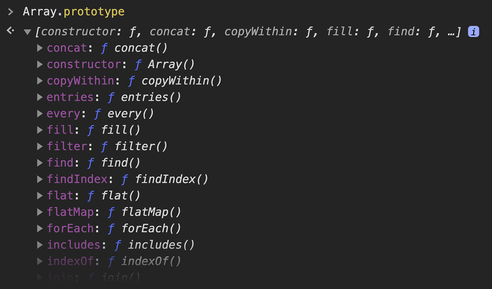

# Arrays

Un **array** es una colección de elementos. Estos elementos pueden ser combinaciones de cualquier tipo: primitivos u objetos.

A diferencia de otros objetos, los elementos de un array se encuentran **indexados**, es decir, organizados por un índice numérico, y **ordenados** en base a ese índice.

Un array puede también tener posiciones vacías, o incluso estar completamente vacío.

Para crear un *literal de array*, simplemente envolvemos una serie de elementos entre corchetes, y los separamos con comas.

```javascript
["Juan", "María", "José"]
```

También podemos crear un array utilizando la función global `Array()`.

```javascript
Array("Juan", "María", "José")

// o bien

Array(["Juan", "María", "José"])
```

Podemos acceder a los elementos de un array así como insertar elementos nuevos utilizando la siguiente sintaxis:

```javascript
var miArray = ["PI"];
miArray[1] = 3.14;
miArray[2] = null;

miArray;         // → ["PI", 3.14, null]
miArray[0]);     // → "PI"
miArray.length;  // → 3
```

## Uso Práctico de Arrays

El array es la estructura de datos en que guardamos elementos en serie.

Supongamos que desde JavaScript hacemos una solicitud asíncrona a un servidor, para que nos devuelva una lista de productos que se encuentran en un carrito de compras. Esa lista, sea cual fuere el formato en el que la recibimos del servidor (JSON, XML, etc), es muy probable que al recibirla debamos transformarla en un array, para luego poder procesarlo, e iterar sobre sus elementos para mostrarlos en pantalla.

A continuación te presento algunos de los principales métodos de array, que nos van a ser muy útiles en situaciones como esta.

## Métodos de Array

Podemos conocer todos los métodos de Array disponibles explorando el prototipo de la función global `Array` en la consola de Google Chrome mediante la siguiente expresión:

```javascript
Array.prototype
```

Lo que nos dará como resultado una lista similar a la siguiente:



A continuación vamos a explorar algunos de los métodos más utilizados para la manipulación de arrays.

A> Para una lista completa de métodos de array visita [este link](https://developer.mozilla.org/en-US/docs/Web/JavaScript/Reference/Global_Objects/Array).

### push()

El método `push()` inserta uno o más elementos al final de un array, y devuelve un número con su nueva longitud `length`.

Cada valor que reciba el método como argumento es insertado al final del array. Como resultado, el array original es modificado.

```javascript
var animales = ["perro", "gato"];

animales.push("caballo");         // → 3
animales.push("vaca", "conejo");  // → 5

animales;
// → ["perro", "gato", "caballo", "vaca", "conejo"]
```

### concat()

El método `concat()` concatena dos o más arrays, y devuelve como resultado un array nuevo, sin modificar el array inicial.

Recibe como argumento cero o más arrays a concatenar con el array inicial. Si no se le pasa argumentos, devuelve un nuevo array igual al anterior.

```javascript
var array1 = [1, 2, 3];
var array2 = [4, 5, 6];
var array3 = [7, 8, 9];
var array4 = array1.concat(array2, array3);

array4;  // → [1, 2, 3, 4, 5, 6, 7, 8, 9]
```

### map()

El método `map()` recibe como argumento una función, comúnmente conocida como *callback*, y retorna un nuevo array con el resultado de aplicar esa función a cada uno de sus elementos.

La función aplicada a `map()` acepta tres argumentos. El primero de ellos es obligatorio, y es el **valor** siendo procesado. Opcionalmente, también acepta:

* El **índice** de posición en el array del valor siendo procesado;
* El **array** sobre el que se llamó el método;

```javascript
array.map(function callback (valor, indice, array) {
  // retornar alguna modificación del valor
})
```

Por ejemplo:

```javascript
var numeros = [2, 4, 6, 8, 0];

var numerosMapeados = numeros.map(
  function callback (numero, indice) {
    return indice + ": " + numero;
  }
)

numerosMapeados;  // → ["0: 2","1: 4","2: 6","3: 8","4: 0"]
```

La función callback puede recibir cualquier nombre, o ser anónima. En este ejemplo la llamamos sencillamente `callback`.

También se puede usar como argumento de `map()`, al igual que de cualquier otra función, una referencia a una función declarada por separado, lo cual contribuye a que el código sea más fácil de leer.

```javascript
var numeros = [2, 4, 6, 8, 0];

function duplicar (numero) {
  return numero * 2;
}

numeros.map(duplicar);  // → [4, 8, 12, 16, 0]
```

### reduce()

El método `reduce()` recibe como argumento una función *reductora*, y retorna un único valor basado en la aplicación esa función a cada uno de sus elementos.

Además, el método acepta un segundo argumento opcional para indicar un valor inicial.

```javascript
var numeros = [0, 1, 1, 2, 3, 5, 8];

var suma = numeros.reduce(
  function reductor (acumulador, valor, indice, array) {
    acumulador = acumulador + valor;
    return acumulador
  },
  0
);

suma;  // → 20
```

La función reductora, requiere los siguientes argumentos:

* Un **acumulador** del valor devuelto por la función en cada llamado. Si se especificó un valor inicial, el acumulador lo devuelve en el primer llamado;
* El **valor** del array siendo procesado;

Opcionalmente, acepta dos argumentos más:

* El **índice** de posición en el array del valor siendo procesado;
* El **array** sobre el que se llamó el método;

El mismo código del ejemplo anterior podría también escribirse de la siguiente forma:

```javascript
function reductor (acumulador, valor, indice, array) {
  acumulador = acumulador + valor;
  return acumulador
}

var numeros = [0, 1, 1, 2, 3, 5, 8];
var suma = numeros.reduce(reductor, 0);

suma;  // → 20
```

### filter()

El método `filter()` recibe como argumento una función *filtro*, y retorna un nuevo array con los elementos que cumplan la condición implementada por esa función.

El nombre de este método puede generar confusión, dado que estamos acostumbrados a que cuando hablamos de un filtro, solemos pensarlo como algo que excluye, es decir, lo que podríamos llamar un *filtro exclusivo*.

Sin embargo, la función filtro en JavaScript se encarga de detectar a los valores que serán incluídos en el resultado, y es por lo tanto un *filtro inclusivo*.

```javascript
var numeros = [-10, 100, -25, 340, 0, -2, 45];

// retorna los números mayores a 0
function filtro (numero, indice, array) {
  return numero > 0;
}

var numerosPositivos = numeros.filter(filtro);
numerosPositivos;  // [100, 340, 45]
```

La función filtro recibe los mismos argumentos que `map()`:

* El **valor** siendo procesado;
* El **índice** del valor siendo procesado (opcional);
* El **array** sobre el que se llamó el método (opcional);

Si ningún elemento cumple la condición de la función filtro, el método `filter()` devuelve un array vacío.
