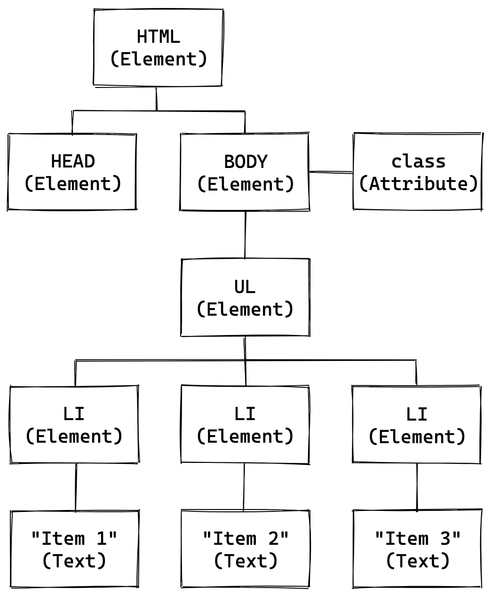

# Manipulando el DOM

El **DOM** o **Document Object Model**, lo que podríamos traducir como *Modelo de Objetos del Documento*, es una representación, estructurada y orientada a objetos, de un documento web.

A través de JavaScript podemos interactuar con esta estructura y modificarla, y así alterar la representación en el navegador de nuestros documentos web, su estilo, su estructura, y su contenido.

La estructura del DOM tiene una jerarquía de árbol. Por eso es normal referirse a él como **Árbol del DOM** (*DOM Tree*).

En las ramas de ese árbol se encuentran nodos, cada uno de los cuales representa un elemento del documento.

Por ejemplo, dado el siguiente código HTML:

```html
<html>
  <head>
    <title>Ejemplo</title>
  </head>
  <body class="home">
    <ul>
      <li>Item 1</li>
      <li>Item 2</li>
      <li>Item 3</li>
    </ul>
  </body>
</html>
```

Una vez *parseado* este código por el navegador, el HTML pasa a convertirse en un árbol de nodos que podría representarse gráficamente este de la siguiente forma:



JavaScript nos permite interactuar con este árbol de nodos de la misma forma que interactuamos con otros objetos. Podemos leerlos, modificarlos, eliminarlos y agregar nuevos.

El DOM no es un lenguaje de programación en sí, sino que es una *Interfaz de Programación de Aplicaciones*, o *API*, que forma parte del grupo de las llamadas **APIs Web**. Estas APIs permiten realizar diferentes tareas dentro de un contexto web utilizando JavaScript.

El DOM, entonces, es la API que le permite a JavaScript realizar una de sus tareas más importantes en el contexto de un documento web, como es la de controlar y manipular sus elementos.

Si bien originalmente JavaScript y el DOM fueron desarrollados en paralelo, con el tiempo continuaron su evolución de forma independiente. Hoy en día, el DOM tiene [su propia especificación](https://dom.spec.whatwg.org/), y es posible interactuar con su API utilizando diferentes lenguajes de programación, como Java o PHP.

En esta sección vamos a explorar las formas de interactuar con el DOM utilizando JavaScript, los objetos que tenemos disponibles para hacerlo, y sus principales métodos.

## Selectores

En JavaScript contamos con una serie de métodos denominados **selectores** que nos permiten seleccionar elementos de nuestro documento, y luego tratarlos como objetos: consultar y modificar sus propiedades, e invocar sus métodos.

Veamos cómo funcionan estos métodos. Para eso nos basaremos en el siguiente fragmento de HTML:

```html
<ul>
  <li id="primero" class="item">Item 1</li>
  <li class="item">Item 2</li>
  <li class="item">Item 3</li>
</ul>
```

### getElementById()

Recibe como argumento un string, y retorna un único nodo cuyo atributo `id` se corresponda con eél. Cabe recordar que en HTML, un valor de atributo `id` debe ser utilizado solo una vez en cada documento.

```javascript
var primerItem = document.getElementById("primero");

primerItem;
// → <li id="primero" class="item">Item 1</li>
```

### getElementsByClassName()

Recibe como argumento un string, y retorna una **colección de nodos** cuyo atributo `class` se corresponda con él.

```javascript
var items = document.getElementsByClassName("item");

items.length;  // → 3
```

Cuando un selector, cualquiera sea, devuelve una colección de nodos, podemos contar la cantidad de items que contiene mediante la propiedad `length`, así como acceder a los diferentes elementos de esta colección, de la misma forma que lo hacemos en un array.

```javascript
items[1];
// → <li class="item">Item 2</li>
```

### getElementsByTagName()

Recibe como argumento un string que corresponde al nombre de una etiqueta HTML, y retorna una **colección de nodos** que coinciden con esa etiqueta.

```javascript
var items = document.getElementsByTagName("li");

items.length;  // → 3
```

### querySelector()

Recibe como argumento un string que corresponde con uno o más selectores CSS separados por comas, y retorna el **primer nodo** que coincida con el selector.

```javascript
var primerItem = document.querySelector("ul li.item");

primerItem;
// → <li id="primero" class="item">Item 1</li>
```

### querySelectorAll()

Recibe como argumento un string que corresponde con uno o más selectores CSS separados por comas, y retorna una lista de nodos que coincidan con el selector.

```javascript
var items = document.querySelectorAll("ul li.item");

items.length;  // → 3
```

## Insertando Contenido

Mediante las propiedades `innerText` e `innerHTML` podemos manipular el contenido de texto y el HTML dentro de un elemento del DOM.

```javascript
var items = document.querySelectorAll("ul li.item");

items[1];  // → <li class="item">Item 2</li>
items[1].innerText;  // → "Item 2"

items[1].innerText = "Segundo item";
items[1];  // → <li class="item">Segundo item</li>

items[2];  // → <li class="item">Item 3</li>
items[2].innerHTML;  // → "Item 3"
items[2].innerHTML = "<strong>Tercero</strong>";
items[2].innerHTML;  // → <strong>Tercero</strong>
items[2];
// → <li class="item"><strong>Tercero</strong></li>
```

## Crear Nuevos Elementos

### createElement()

El método `createElement()` nos permite crear un nuevo elemento nodo. Recibe como argumento obligatorio el nombre del elemento a crear.

```javascript
document.createElement(nombreDelElemento)
```

Supongamos que queremos insertar un nuevo `<div>` en nuestro documento:

```javascript
var div = document.createElement("div");

div;  // → <div></div>
```

Como vemos, `createElement()` nos retorna un nuevo elemento `<div>`, que almacenamos en la variable `div`.

*—Pero... ¿Y dónde se muestra mi `<div>`?*

¡Tranquilo! El `<div>` aun no se muestra en pantalla, solo esta guardado en memoria. Mas adelante lo insertaremos en el DOM. Pero primero, vamos a hacerle algunas modificaciones.

Si ya haz creado documentos HTML en el pasado, sabes que un `<div>` vacío no nos mostrará nada en patalla. Así que vamos a darle algo de contenido.

```javascript
div.innerText = "Aprendiendo JavaScript";

div;
// → <div>Aprendiendo JavaScript</div>
```

¡Ahora nuestro `<div>` tiene contenido!

Aunque a decir verdad, un `<div>` no tiene ningún formato. Entonces, hagamos que su contenido sea mejor un encabezado. Para eso utilizaremos la etiqueta `<h1>`.

Para eso creamos un nuevo elemento `<h1>`:

```javascript
var encabezado = document.createElement("h1");
encabezado.innerText = "Manipulando el DOM";

encabezado;
// → <h1>Manipulando el DOM</h1>
```

Ya tenemos nuestros `<div>` y `<h1>` listos. ¿Cómo reemplazamos el viejo texto por nuestro nuevo encabezado?

### replaceChild()

El método `replaceChild()` nos posibilita reemplazar un nodo por otro. Recibe dos argumentos, el nuevo nodo y el nodo a reemplazar.

```javascript
nodo.replaceChild(nuevoNodo, viejoNodo)
```

Volviendo a nuestro `<div>`, vamos a cambiar su viejo texto plano por nuestro nuevo `<h1>`.

Para comenzar debemos saber que un texto es también en sí un nodo del DOM, en este caso de tipo `Text`, mientras que nuestros `<div>` y `<h1>` son nodos de tipo `Element`.

Entonces, sabiendo esto, lo que queremos hacer ahora es reemplazar nuestro anterior nodo de texto, por el nuevo nodo elemento.

Para ello nos serviremos con la propiedad `childNodes` que poseen los nodos del DOM, y que nos retorna un objeto `NodeList` con los nodos *hijo* del nodo en cuestión.

```javascript
var viejoNodoDeTexto = div.childNodes[0];

viejoNodoDeTexto;  // → "Aprendiendo JavaScript"

div.replaceChild(encabezado, viejoNodoDeTexto);

div;
// → <div>
// →   <h1>Manipulando el DOM</h1>
// → </div>
```

¿Genial, no? Vamos por más.

Ahora vamos a agregar un párrado a nuestro `<div>`. Para ello creamos un nuevo elemento `<p>`.

```javascript
var parrafo = document.createElement("p");
parrafo.innerText = "Adjuntando nodos.";

parrafo;  // → <p>Adjuntando nodos.</p>
```

Tenemos ahora un nuevo desafío. ¿Cómo insertamos el nuevo párrafo dentro de nuestro `<div>` e inmediatamente después del `<h1>`?

### appendChild()

Utilizando el método `appendChild()` podemos adjuntar un nuevo elemento nodo dentro de un elemento *padre*. Simplemente invocamos el método sobre `div` pasándole como argumento el nuevo nodo.

```javascript
div.appendChild(parrafo);

div;
// → <div>
// →   <h1>Manipulando el DOM</h1>
// →   <p>Adjuntando nodos.</p>
// → </div>
```

¡Voilà! Nuestro `div` sigue creciendo, igual que nuestra habilidad para manipular el DOM.

¿Qué sucede si de repente recordamos (porque nos distrajimos entre tantos métodos) que queríamos otro párrafo antes del actual?

Nuestra primer reacción podría ser: *—¡Al diablo! `div.innerHTML` y listo.*

Por suerte, una fracción de segundo después recordamos que queremos ser programadores metódicos y responsables, y decidimos seguir explorando las posibilidades que nos da JavaScript.

### cloneNode()

Mediante `cloneNode()` podemos literalmente clonar un nodo del DOM.

Veamos cómo funciona clonando nuestro párrafo:

```javascript
var parrafo2 = parrafo.cloneNode(true);

parrafo2;  // → <p>Adjuntando nodos.</p>
```

Con el argumento `true` lo que hacemos es decirle a `cloneNode()` que queremos clonar el nodo y todos sus nodos hijo, incluyendo los de texto.

Sin embargo, en nuestro ejemplo queremos un texto diferente, asi que clonaremos únicamente el nodo, sin hijos, y luego le adjuntaremos nuestro texto deseado. Esta vez, usaremos un nuevo método, `createTextNode()`, que funciona igual que `createElement()` pero para nodos de texto.

```javascript
parrafo2 = parrafo.cloneNode();

parrafo2;  // → <p></p>

var texto = document.createTextNode("JavaScript es genial!");
parrafo2.appendChild(texto);

parrafo2;  // → <p>JavaScript es genial!</p>
```

¡Ahora sí! Estamos un paso más cerca de nuestro objetivo de mostrar el contenido en pantalla.

### insertBefore()

El método `insertBefore()` acepta dos argumentos, un nuevo nodo a insertar y uno existente de referencia, y como resultado, insertará el primero justo antes del segundo.

```javascript
nodo.insertBefore(nuevoNodo, nodoExistente)
```

Usemos entonces este método para insertar nuestro nuevo `<p>` clonado antes de nuestro anterior `<p>`.

```javascript
div.insertBefore(parrafo2, parrafo);

div;
// → <div>
// →   <h1>Manipulando el DOM</h1>
// →   <p>JavaScript es genial!</p>
// →   <p>Adjuntando nodos.</p>
// → </div>
```

Nuestro `<div>` ya está lo suficientemente maduro para mostrarlo en el navegador.

Para lograrlo, debemos ahora adjuntarlo a cualquier elemento existente y visible. En este caso, lo adjuntaremos directamente en el `<body>` de nuestro documento.

Para ello, podemos utilizar `appendChild()` de la forma que vimos anteriormente.

```javascript
document.body.appendChild(div);

document.body;  // → para ver el resultado
```

Si el body de nuestro documento web estaba vacío, debería ahora verse de la siguiente forma:

```html
<body>
  <div>
    <h1>Manipulando el DOM</h1>
    <p>JavaScript es genial!</p>
    <p>Adjuntando nodos.</p>
  </div>
</body>
```

¡Felicitaciones! Hemos creado y manipulado elementos del DOM, y sin necesidad de ninguna librería o *framework*.

En ocasiones tendremos la necesidad también de manipular elementos ya visibles del documento. Para ello nos serviremos de los mismos métodos, en combinación con los *selectores*.

Por ejemplo, ¿qué haríamos si quisiéramos remover uno de los párrafos del nuevo `<div>`?

### remove() y removeChild()

`remove()` y `removeChild()` nos permiten eliminar elementos del DOM. `remove()` es un poco mas sencillo para usar, aunque no es compatible con Internet Explorer 11 y versiones anteriores (en los cada vez menos frecuentes casos en que debamos dar soporte a este navegador).

```javascript
node.remove();
node.removeChild(nodoHijo);
```

Para remover uno de los párrafos dentro de nuestro `<div>` podemos hacerlo de dos formas: si aun tenemos acceso a las variables que creamos anteriormente, podemos reutilizarlas para referirnos a los mismos elementos del DOM que ahora son visibles. Si no, podemos volver a crear referencias a esos elementos utilizando *selectores*.

```javascript
// creamos nuevas referencias si hace falta
var div = document.querySelector("div");
var parrafo = div.childNodes[2];

// y luego modificamos
parrafo.remove();

// o bien
div.removeChild(parrafo);
```

## Manipulando Atributos

Cuando necesitemos agregar, modificar y/o remover atributos de los diferentes nodos del DOM, contamos con métodos para este fin.

En los siguientes ejemplos continuamos utilizando los elementos que creamos anteriormente.

### setAttribute()

El método `setAttribute()` modifica un atributo del nodo, y si el atributo no existe, lo crea.

Acepta dos argumentos, el nombre y el valor del atributo respectivamente.

```javascript
div.setAttribute("id", "contenedor");
encabezado.setAttribute("style", "color: blue;");

div;
// → <div id="contenedor">
// →   <h1 style="color: blue;">Manipulado el DOM</h1>
// →   ...
// → </div>
```

### getAttribute()

El método `getAttribute()` devuelve el valor de un atributo.

```javascript
div.getAttribute("id");            // → "contenedor"
encabezado.getAttribute("style");  // → "color: blue;"
```

### removeAttribute()

El método `removeAttribute()` borra un atributo del elemento.

```javascript
div.removeAttribute("id");
encabezado.removeAttribute("style");

div;
// → <div>
// →   <h1>Manipulado el DOM</h1>
// →   ...
// → </div>
```

## Manipulando Clases

El atributo `class` se utiliza frecuentemente para asociar estilos CSS a los elementos de nuestro HTML. Poder modificar este atributo de forma dinámica con JavaScript nos resultará de utilidad.

### className

La propiedad `className` nos da acceso a la clase o clases de un elemento nodo, en forma de string y separadas por espacios.

```javascript
div.className = "seccion";
div.className;  // → "seccion"

div.className += " contenido";
div.className;  // → "seccion contenido"

div;
// → <div class="seccion contenido">...</div>
```

### classList

La propiedad `classList` nos devuelve un objeto que contiene las diferentes clases del elemento, accesibles mediante su índice.

```javascript
div.classList;
// → ["seccion", "contenido", ...]

div.classList[0];  // → "seccion"
div.classList[1];  // → "contenido"

div.classList.value;  // → "seccion contenido"
```

Para remover una clase podemos utilizar `classList.remove()`:

```javascript
div.classList.remove("contenido");

div.classList.value;  // → "seccion"

div;  // → <div class="seccion">...</div>
```

Para agregar una clase contamos con el método `classList.add()`:

```javascript
div.classList.add("principal");

div.classList.value;  // → "seccion principal"

div;
// → <div class="seccion principal">...</div>
```

Para alternar la presencia de una clase usamos el método `classList.toggle()`:

```javascript
div.classList.value;  // → "seccion principal"

div.classList.toggle("seccion");
div.classList.value;  // → "principal"

div.classList.toggle("seccion");
div.classList.value;  // → "seccion principal"
```
