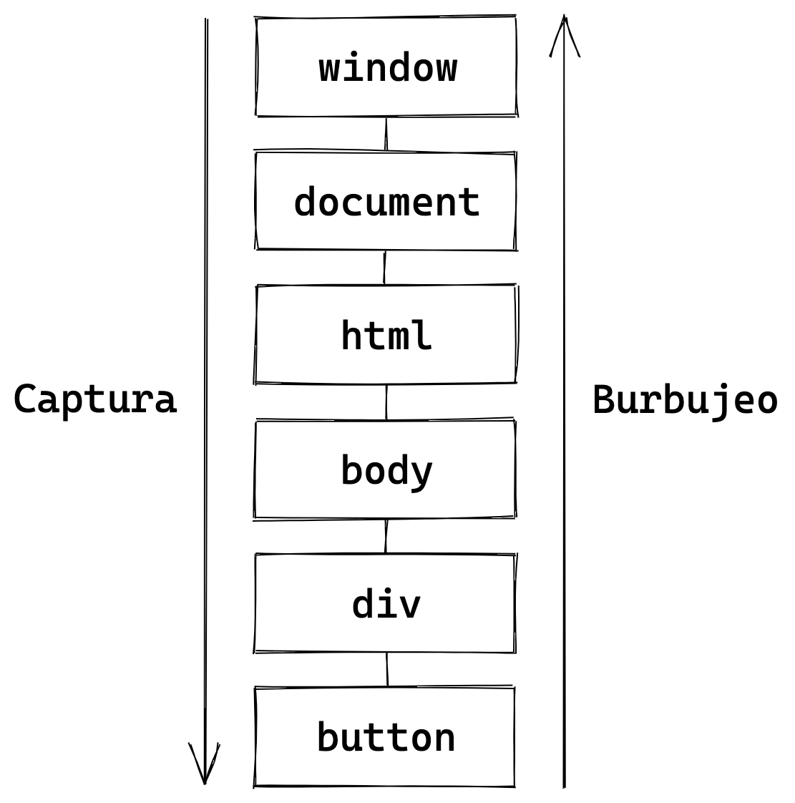

# Eventos del DOM

Imaginemos por un momento que queremos saber en JavaScript cada vez que un botón de nuestra página web es clickeado. ¿Cómo haríamos para resolver esta necesidad con lo que conocemos hasta ahora?

Quizás nos veríamos tentados a crear una función que determine el estado del botón. Ahora bien, para enterarnos lo suficientemente rápido si ese botón fue presionado o no, deberíamos chequear el estado del botón una y otra vez.

Supongamos entonces que usamos la función `setInterval()`, que nos permita llamar a esa función cada, digamos, 100 milisegundos. Esta implementación se vería algo así:

```javascript
setInterval(function observarBoton () {
  // determinar el estado del botón
}, 100);
```

Ahora, imaginemos que tenemos 10 botones en pantalla. Tendríamos entonces 10 temporizadores, generando 10 llamados a la función cada 100 ms, es decir, un total de 100 llamados por cada segundo que el usuario esta corriendo nuestra página web.

A medida que nuestras páginas se volvieran más complejas, comenzarían también a volverse ineficientes, al sobrecargarlas de llamados constantes a funciones *por si acaso* algo hubiera sucedido. Esto causaría que el navegador consuma una cantidad innecesaria de memoria, podría empezar a bloquearse la interfaz de usuario, etc.

Afortunadamente, existe un mecanismo mucho más eficiente y amigable que el que acabamos de describir, que es posible gracias a un subconjunto de **APIs Web** dedicadas al manejo de **Eventos del DOM**.

La API de Eventos del DOM nos sirve para volver a nuestro JavaScript reactivo ante determinados sucesos en nuestra interfaz web.

Algunos de los eventos más comunes que podemos controlar con JavaScript son:

* **Eventos del mouse**: click, doble click, posar el cursor;
* **Eventos del teclado**: presionar y soltar teclas;
* **Eventos de formularios**: enviar, resetear;
* **Eventos de campos de formulario**: cambiar, seleccionar, enfocar, desenfocar;
* **Eventos de la ventana del navegador**: cargar, hacer scroll, cambiar el tamaño;

Existen innumerables usos prácticos para los Eventos del DOM. Algunos de los que vemos con frecuencia en los sitios con los que interactuamos a diario son:

* Al hacer **click** en un botón, abrir una nueva ventana tipo popup;
* Desplegar nuevos campos de un formulario al **seleccionar** cierta opción de un campo desplegable;
* Al **enviar** un formulario, validar cada campo, y cancelar el envío si hay errores;

## Observando Eventos

Los elementos del DOM cuentan con el método `addEventListener()`, que nos permite asociar un evento determinado con una función **controlador de evento** (*event handler* en inglés).

```javascript
elemento.addEventListener(
  evento,       // string
  controlador,  // función
  usar_captura  // booleano (opcional)
)
```

Veamos un ejemplo. Dado el siguiente fragmento de HTML:

```html
<button id="boton">Hola</button>
```

Declaramos un observador de evento:

```javascript
var boton = document.getElementById("boton");
boton.addEventListener("click", onClick);

function onClick (event) {
  this.style.backgroundColor = "red";
}
```

Observamos el evento `click` sobre el elemento `boton`. Cuando se dispara este evento (cuando el usuario hace click en el botón), se invoca a la función controlador `onClick`, que modifica el color de fondo del botón a rojo.

Analicemos ahora uno por uno los parámetros que recibe el método `addEventListener()`.

## Controlador de Evento

La función `controlador` es la que determina la acción a realizar al dispararse el evento.

Recibe como primer argumento un objeto de tipo `Event`, que contiene propiedades y métodos relacionados con el evento disparado.

En el ejemplo anterior, el valor recibido por el parámetro `event` es más específicamente de tipo `MouseEvent`, un tipo de evento "hijo" de `Event`, que recibe información adicional en relación al mouse, como por ejemplo las coordenadas de la pantalla en las que se hizo click, y qué botón del mouse se presionó.

Dentro de una función controlador, la palabra clave `this` hace referencia al elemento del DOM que disparó el evento, en este caso el botón. En el ejemplo, `this` nos es equivalente a utilizar la variable `boton`, ya que ambas hacen referencia a nuestro elemento `<button>`.

## Evento

El parámetro `evento` consiste en un string correspondiente al nombre del evento a observar.

Existe una gran cantidad de eventos que podemos controlar en JavaScript. A continuación nombro un pequeño grupo de los que se utilizan con mayor frecuencia:

### Eventos del mouse

* [click](https://developer.mozilla.org/en-US/docs/Web/API/Element/click_event)
* [dblclick](https://developer.mozilla.org/en-US/docs/Web/API/Element/dblclick_event)
* [mouseover](https://developer.mozilla.org/en-US/docs/Web/API/Element/mouseover_event)
* [mouseout](https://developer.mozilla.org/en-US/docs/Web/API/Element/mouseout_event)
* [mousemove](https://developer.mozilla.org/en-US/docs/Web/API/Element/mousemove_event)

### Eventos del teclado

* [keyup](https://developer.mozilla.org/en-US/docs/Web/API/Element/keyup_event)
* [keydown](https://developer.mozilla.org/en-US/docs/Web/API/Element/keydown_event)

### Eventos de formularios

* [change](https://developer.mozilla.org/en-US/docs/Web/API/HTMLElement/change_event)
* [submit](https://developer.mozilla.org/en-US/docs/Web/API/HTMLFormElement/submit_event)
* [focus](https://developer.mozilla.org/en-US/docs/Web/API/Element/focus_event)
* [blur](https://developer.mozilla.org/es/docs/Web/Events/blur)

### Eventos de la ventana e interfáz de usuario

* [load](https://developer.mozilla.org/en-US/docs/Web/API/XMLHttpRequest/load_event)
* [error](https://developer.mozilla.org/en-US/docs/Web/API/Element/error_event)
* [resize](https://developer.mozilla.org/en-US/docs/Web/API/Window/resize_event)
* [scroll](https://developer.mozilla.org/en-US/docs/Web/API/Document/scroll_event)
* [beforeunload](https://developer.mozilla.org/en-US/docs/Web/API/Window/beforeunload_event)
* [unload](https://developer.mozilla.org/en-US/docs/Web/API/Window/unload_event)

A> Para una referencia completa de eventos disponibles y ejemplos de uso, visita [este link](https://developer.mozilla.org/es/docs/Web/Events).

### Un ejemplo práctico

El evento `click` es uno de los que más frecuentemente nos tocará controlar. Se puede observar en cualquier  elemento de un documento HTML, excepto en algunos pocos como `<iframe>`, `<br>` y otros a los que simplemente no es posible hacer click, como `<head>` o `<title>`.

Veamos un ejemplo práctico de manejo de este evento:

Creamos un elemento `<a>` que será sobre el cual observamos los clicks, y un `<div>` que inicialmente ocultamos con la clase `hidden`.

```html
<style>.hidden { display: none }</style>

<a href="contenido.html" class="link">Mostrar</a>

<div id="contenido" class="hidden">
  <h3>Top Secret</h3>
  <p>Este contenido esta oculto.</p>
</div>
```

Luego con JavaScript observamos los `click` sobre el `<a>` con `addEventListener()`, y establecemos una función `mostrarContenido()` como controlador.

```javascript
var link = document.querySelector(".link");
var contenido = document.querySelector("#contenido");

link.addEventListener("click", mostrarContenido);

function mostrarContenido (event) {
  event.preventDefault();
  contenido.classList.toggle("hidden");
  this.innerText = contenido.classList.contains("hidden")
    ? "Mostrar"
    : "Ocultar";
}
```

Dentro de `mostrarContenido()` lo que hacemos es, primero, utilizando el método `preventDefault()` del objeto `event` *prevenimos* cualquier acción por defecto del `<a>`, en este caso, para evitar abrir `contenido.html` y permanecer en la página actual.

Luego, con el método `classList.toggle()` alternamos la presencia de la clase `hidden` en nuestro `<div>`, lo que a su vez alterna su visibilidad.

Por último, utilizamos `this.innerText` para modificar el texto del `<a>` según la visibilidad del `contenido`. Para saber si el contenido esta visible o no, usamos el método `classList.contains()` para detectar la presencia de la clase `hidden`. Y luego utilizamos un condicional ternario para decidir entre `"Mostrar"` y `"Ocultar"`.

A> En este ejemplo comenzamos a poner en práctica varias de las herramientas adquiridas hasta ahora. Si el ejemplo te resulta algo complejo, te invito a repasar el código y la explicación nuevamente las veces que sea necesario, y a ponerlo en práctica en tu editor de código.

## Propagación del Evento

Supongamos que tenemos el siguiente documento HTML:

```html
<html>
  <body>
    <div id="contenido">
      <button id="boton">Clickeame</button>
    </div>
  </body>
</html>
```

Entonces queremos observar los clicks tanto en `<body>` como en `<div>` y `<button>`:

```javascript
var contenido = document.getElementById("contenido");
var boton = document.getElementById("boton");

document.body.addEventListener("click", function (e) {
  console.log("click en body");
});
contenido.addEventListener("click", function (e) {
  console.log("click en contenido");
});
boton.addEventListener("click", function (e) {
  console.log("click en botón");
});
```

Al hacer click en `<button>` no solo estamos disparando el evento `click` en él, sino también en todos sus ancestros: `<div>`, `<body>`, `<html>`, y además `document` y `window`.

Entonces ¿en qué orden se invocarán nuestros controladores de evento?

El concepto de **propagación del evento** es lo que viene a resolver este dilema.

Los eventos se propagan en dos fases. La primera fase es la de **captura** (*capture*). Durante esta fase el evento se propaga desde el objeto `window` hacia el nodo que disparó el evento, llamado **objetivo** (*target*). En esta fase, el nodo objetivo es el último en manejar el evento.

La segunda fase es la de **burbujeo** (*bubbling*). En esta fase sucede exactamente lo opuesto: el evento se maneja primero en el nodo **objetivo**, y luego se propaga por todos sus nodos ancestro hasta llegar al objeto `window`.



Por lo tanto, el orden en que se manejarán los eventos dependerá lo que le comuniquemos al respecto a `addEventListener()` al invocarlo.

Recordemos los parámetros aceptados por el método:

```javascript
elemento.addEventListener(
  evento,       // string
  controlador,  // función
  usar_captura  // booleano (opcional)
)
```

El tercer parámetro `usar_captura` es opcional y es el que vamos a usar para indicarle nuestra intención de propagación.

Si deseamos manejar el evento en fase de **captura**, debemos asignarle el valor `true`. Si por el contrario, queremos hacerlo en fase de **burbujeo**, le asignamos `false`. Este último es el valor que recibe el parámetro por defecto.

En nuestro código de ejemplo, no le asignamos ningún valor a este parámetro y por lo tanto se asume `false`, manejándose los tres en fase de **burbujeo**, resultando en el siguiente orden:

1. `<button>`
2. `<div>`
3. `<body>`

Y por lo tanto la salida a consola será:

```javascript
// -> "click en botón"
// -> "click en contenido"
// -> "click en body"
```

Otra forma de comprender el orden en que se manejarán los eventos, es pensándolo de la siguiente forma:

Si todos los nodos de nuestro documento de ejemplo estuvieran observando el evento `click`, el orden den que se manejaría el evento en los diferentes nodos sería el siguiente, independientemente del orden en que los declaremos en el código:

```javascript
function ctrl (evento) {
  // ...
}

// inicio de fase de captura
window.addEventListener("click", ctrl, true);
document.addEventListener("click", ctrl, true);
document.html.addEventListener("click", ctrl, true);
document.body.addEventListener("click", ctrl, true);
contenido.addEventListener("click", ctrl, true);
boton.addEventListener("click", ctrl, true);
// fin de fase de captura

// inicio de fase de burbujeo
boton.addEventListener("click", ctrl, false);
contenido.addEventListener("click", ctrl, false);
document.body.addEventListener("click", ctrl, false);
document.html.addEventListener("click", ctrl, false);
document.addEventListener("click", ctrl, false);
window.addEventListener("click", ctrl, false);
// fin de fase de burbujeo
```

## Dejar de Observar Eventos

En ocasiones necesitaremos desasociar un controlador de evento de un elemento, por ejemplo para liberar memoria o prevenir resultados no deseados. En ese caso debemos utilizar el método `removeEventListener()`, pasándole los mismos argumentos con los que se invocó `addEventListener()`.

```javascript
elemento.removeEventListener(evento, controlador, usar_captura)
```

Por ejemplo:

```javascript
var boton = document.getElementById("boton");
boton.addEventListener("click", onClick, true);

function onClick (event) {
  this.style.backgroundColor = "red";
}

// mas tarde...

boton.removeEventListener("click", onClick, true);
```